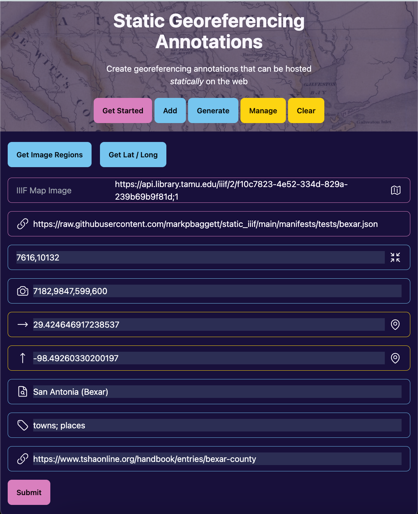

# Static Georeferencing Annotations

Proof of Concept application for creating georeferencing annotations so that they can be displayed in
[nakamura196's iiif_geo](https://github.com/nakamura196/iiif_geo).

## Installing

```pipx install static_georef_annotations```

## Using

Create annotations, click `Generate`, store online (GitHub Pages integration in progress)



Then, view your annotations in [iiif-geo](https://github.com/nakamura196/iiif_geo).

]

## To do:

- [x] Load iiif image via HTTP param (??iiif-image=)
- [x] Add `X` georeferencing annotations related to a canvas
- [x] Get image points from a IIIF image
- [x] Get image region for an entire annotation on the IIIF image
- [x] Get latitude and longitude related to the annotation
- [x] Add annotation label, tags, and url for each annotation
- [x] Tie in generate route so the annotation can be exported
- [ ] Add component to store annotation lists as static content in Github Pages
- [ ] Allow existing annotation lists to be loaded into the application and expand
- [ ] Add route to manage annotations so that annotations can be edited or deleted from list
- [ ] Add detailed tutorial in `Get Started`
- [ ] Add route to clear annotations in memory
